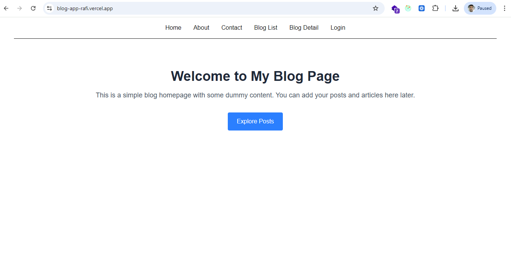
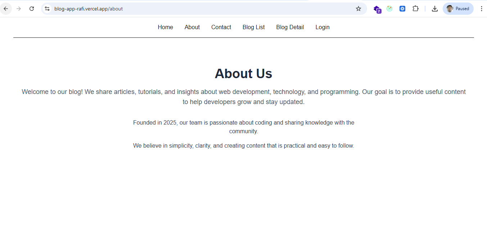
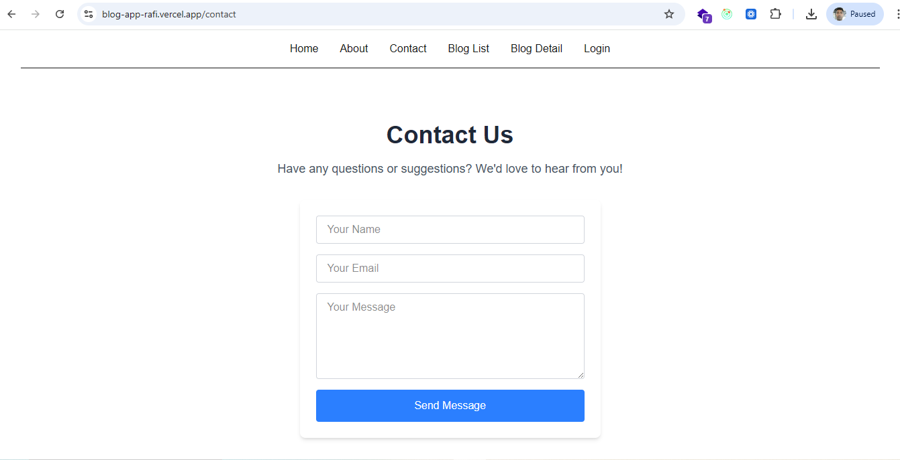
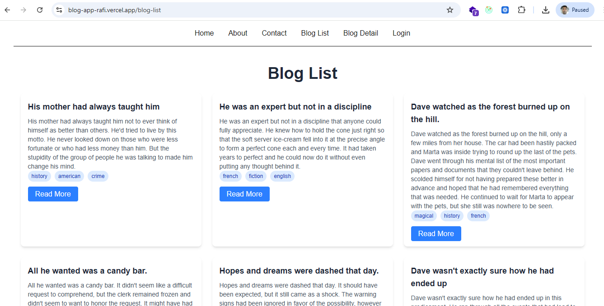
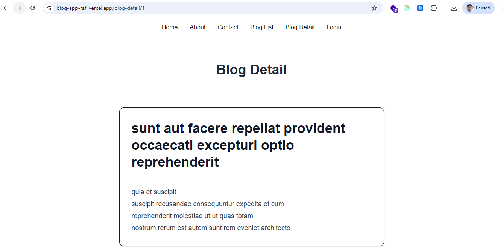
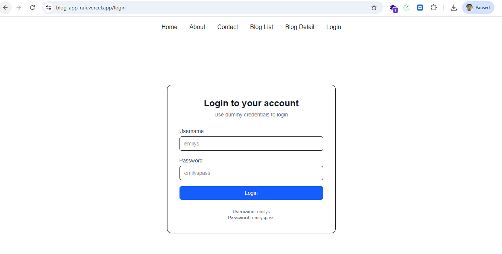
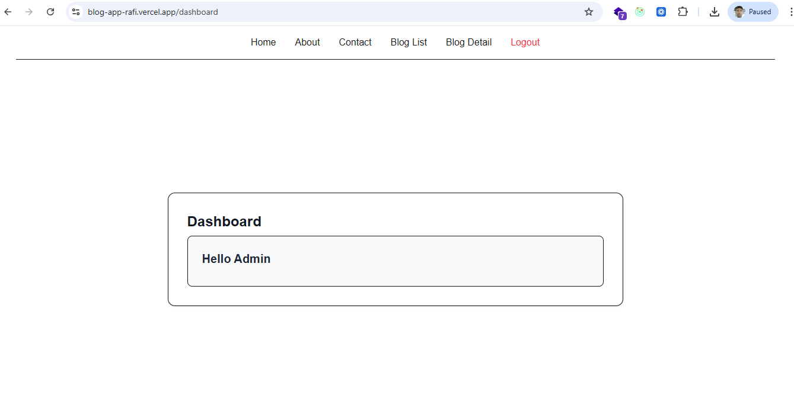

# 📝 Blog Application (Next.js + Redux Toolkit + Redux-Saga)

[](https://blog-app-rafi.vercel.app/)  
[](https://github.com/mohdrafi854/Nextjs-Assignment.git)

---

## 🚀 Project Description
This is a **blog application** built using **Next.js App Router**, **Redux Toolkit**, and **Redux-Saga**.  
The project demonstrates:

- Real-world frontend architecture  
- Async state management with Redux-Saga  
- Authentication flow  
- Clean UI handling  
- API integration with **DummyJSON**  

---

## ⚙️ Setup Instructions (Run Locally)

1. **Clone the repository**
   ```bash
   git clone https://github.com/mohdrafi854/Nextjs-Assignment.git
   cd Nextjs-Assignment
   ```

2. **Install dependencies**
   ```bash
   npm install
   cd client
   npm install
   ```

3. **Run the project**
   ```bash
   npm run server      # start backend/server if needed
   cd client
   npm start           # start frontend
   ```

4. **Open in browser**
   ```
   http://localhost:3000
   ```

---

## 🛠️ Technologies Used
- **Frontend:** Next.js (App Router), React  
- **State Management:** Redux Toolkit, Redux-Saga  
- **Styling:** Tailwind CSS  
- **API:** DummyJSON API  

---

## ✅ Features Implemented

### Core Application
- [x] Next.js App Router project setup  
- [x] Home, About, Contact pages (UI only)  
- [x] Blog List page with API integration  
- [x] Blog Detail page using dynamic routing (`[id]`)  
- [x] Login page with UI, loading & error handling  
- [x] Basic Admin Dashboard page  

### State Management
- [x] Redux Toolkit store configuration  
- [x] Auth Slice (login, logout, token handling)  
- [x] Posts Slice (blog list & single post)  
- [x] Redux-Saga integration for async API handling  
- [x] Clean separation of UI and business logic  

### Redux-Saga
- [x] Auth Saga: Login API integration, token persistence in state  
- [x] Posts Saga: Fetch all posts, fetch single post by ID  
- [x] Proper loading, success, and error states  
- [x] Saga effects used: `takeLatest`, `call`, `put`  

### UI & UX
- [x] Tailwind CSS responsive UI  
- [x] Reusable components (Navbar, Cards, Loader)  
- [x] Login → Logout toggle in Navbar  
- [x] Error and loading indicators  

---

## 📸 Screenshots / GIFs

**Home Page:**  
  

**About Page:**  
  

**Contact Page:**  
  

**Blog List Page:**  
  

**Blog Detail Page:**  
  

**Login Page:**  
  

**Admin Dashboard:**  
  

> Replace the `screenshots/` images with your actual screenshots or GIFs.

---

## 🛠 Challenges Faced & Solutions
- **Challenge:** Integrating Redux-Saga smoothly with Next.js App Router and client components  
  **Solution:**  
  - Used a dedicated Redux Provider  
  - Kept sagas isolated from UI  
  - Ensured client components handled Redux hooks properly  

---

## 🌟 Future Improvements
- Full route protection using Next.js middleware  
- Blog CRUD operations from dashboard  
- Comments feature with Redux-Saga  
- SEO using Metadata API  
- Dark mode support  
- Toast notifications  
- Better caching and offline support  